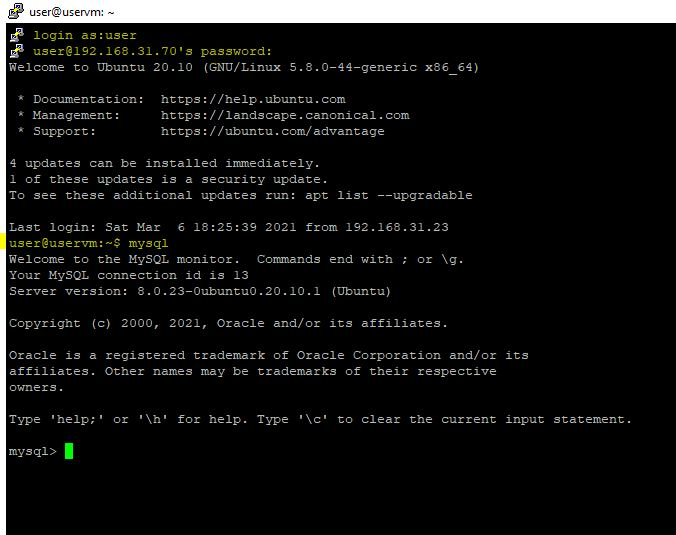
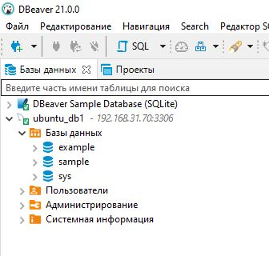
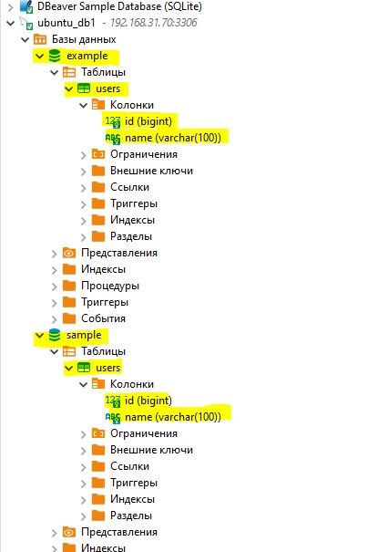

# Основы реляционных баз данных. MySQL
## Засуха Роман Евгеньевич
(находится в работе)

Оглавление:
- [ДЗ 1]
- [Урок 2](#Урок-2).
- [Урок 3](#Урок-3).

# Урок 2.
## Практическое задание по теме “Управление БД”

1.Установите СУБД MySQL. Создайте в домашней директории файл .my.cnf, задав в нем логин и пароль, который указывался при установке.

2.Создайте базу данных example, разместите в ней таблицу users, состоящую из двух столбцов, числового id и строкового name.

3.Создайте дамп базы данных example из предыдущего задания, разверните содержимое дампа в новую базу данных sample.

4.(по желанию) Ознакомьтесь более подробно с документацией утилиты mysqldump. Создайте дамп единственной таблицы help_keyword базы данных mysql. Причем добейтесь того, чтобы дамп содержал только первые 100 строк таблицы.

# Решение

1.Сам файл с написанным кодом

[Скриншот](enter_ my.cnf.JPG)

[Скриншот](2-lesson\enter_ my.cnf.JPG)

[Скриншот](2-lesson/enter_ my.cnf.JPG)

2.

3.

  

4.увы нет такой базы, но поизучал, получается необходимо использовать limited 100

# Урок 3.
## Вебинар. Введение в проектирование БД

[Скриншот](db_tables_full.JPG)

Добавил поля, провел генирацию данных, но видимо конфликты возникали по связям между таблицами. 

Мысли и предложения по доработкам таблиц:
-Таблицы user и profiles может быть есть смысл объединить?
-user добавить отчество (patronymic_name) и дата последнего входа (last_login_at), возможно еще "платформа" но это уже сложно фиксировать (на данный этап как минимум), поэтому пропускаем.
-profiles добавить id и возможно тоже last_login_at, либо объединить с user
-messages добавить media_id. в сообщениях могут быть медиа файлы. тем самым ссылаемся на них.
-communities были мысли "численность группы" но как реализовать пока не знаю. Какая то формула связанная с communities_users видимо?
Пока перечитывал, понял что по полю последнего входа, будет правильнее создать некую таблицу "аудита" и в ней возможно хранить данные по всем датам, т.е. когда входил, когда вносил изменения, когда подружился, и прочее, но удалять выше не стал что бы ход мысли остался)

# Урок 3.
## Вебинар. CRUD-операции
В папке с ДЗ находится:
les_4_script.sql - выполненные операции с БД + статистика данных
All_table_and_colums - скрин всех таблиц и колонок
vk_les_4.sql - дамп БД.
_____
Для курсовой рассматриваю работу с личным кабинето (связанно с работой, возможно пригодится). ЛК юр лиц, учет самих организаций, их пользователей, логины, даты создания, статус доступа и т.д.
_____
По мыслям о реализации лайков и дислайков приложу также скрин
like_repost.jpeg

